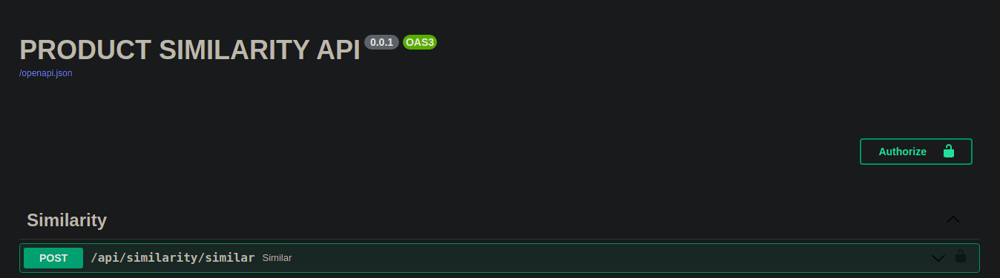
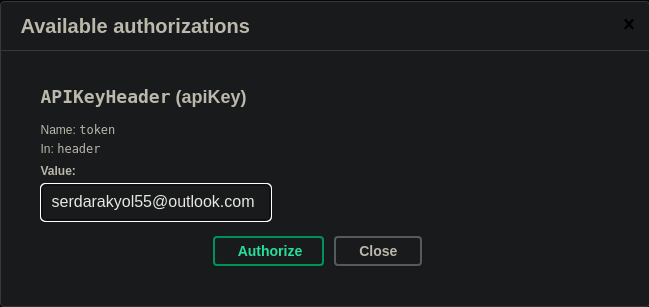
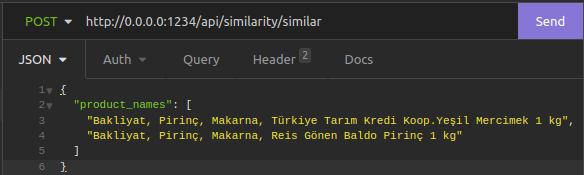
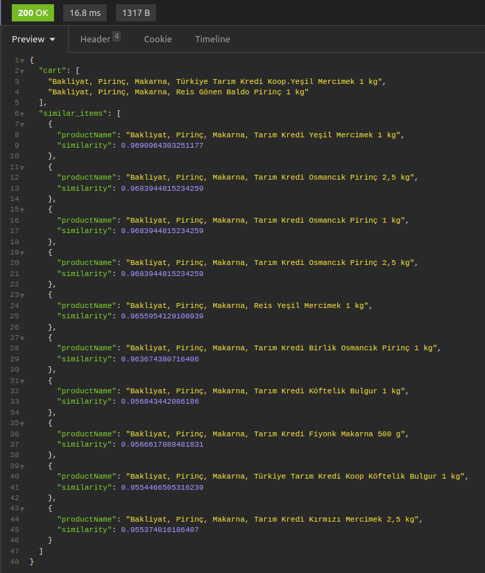

# Product similarity system
This repository provides the top 10 similar products based on the names of the products in your shopping cart

# Word embedding (About model)
Word2Vec(w2v) model chose because I can define the size of output of model with w2v model while training the model. That model uses neural network model to learn word associations from corpus of text. That model contain 2 layer neural networks. Word2vec can utilize either of two model architectures to produce a distributed representation of words. One is continuous bag-of-words (CBOW), another one is continuous skip-gram. Some articles shows that CBOW is faster but skip-gram has better effient for infrequent words.

# Usage
## For Environment
For use the the API, just follow the below codes
#### $ git clone https://github.com/serdarakyol/Semantic-search-based-on-E-commerce-products.git
#### $ cd Semantic-search-based-on-E-commerce-products.git
#### $ virtualenv env
#### $ source env/bin/activate
#### $ pip install -r requirements.txt
#### $ uvicorn similarity_api.main:app --reload --host 0.0.0.0 --port 1234

## For Docker
### $ docker image build -t similarity .
### $ docker run -dp 1234:1234 similarity

Open Insomnia, Postman etc. Create a post request and fill header and value as below

Header | Values
--- | ---
Content-Type | application/json
token | serdarakyol55@outlook.com
## OR
just go to http://0.0.0.0:1234/docs. Click "Authorize" button as shown below.

Then write "serdarakyol55@outlook.com". After click other "Authorize" button as shown below

Then write which product you have on your cart. 

### Request body

### Response body

