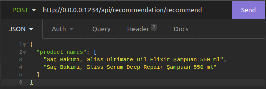
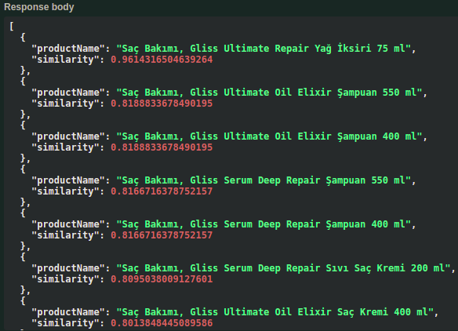

# Recommendation System
This repository tried to solve recommendation problem in e-commerce. Suggesting a new product that the customer may like based on the products in the cart.

# Word embedding (About model)
Word2Vec(w2v) model chose because I can define the size of output of model with w2v model while training the model. That model uses neural network model to learn word associations from corpus of text. That model contain 2 layer neural networks. Word2vec can utilize either of two model architectures to produce a distributed representation of words. One is continuous bag-of-words (CBOW), another one is continuous skip-gram. Some articles shows that CBOW is faster but skip-gram has better effient for infrequent words.

# Usage
For use the the API, just follow the below codes
#### $ git clone https://github.com/serdarakyol/recommendation-system.git
#### $ cd recommendation-system 
#### $ virtualenv env
#### $ source env/bin/activate
#### $ pip install -r requirements.txt
#### $ uvicorn recommendation_api.main:app --reload --host 0.0.0.0 --port 1234

Open Insomnia, Postman or etc. Create a post request and fill header and value as below

Header | Values
--- | ---
Content-Type | application/json
token | serdarakyol55@outlook.com

Then write which product you have on your cart. 

### Request body

### Response body

